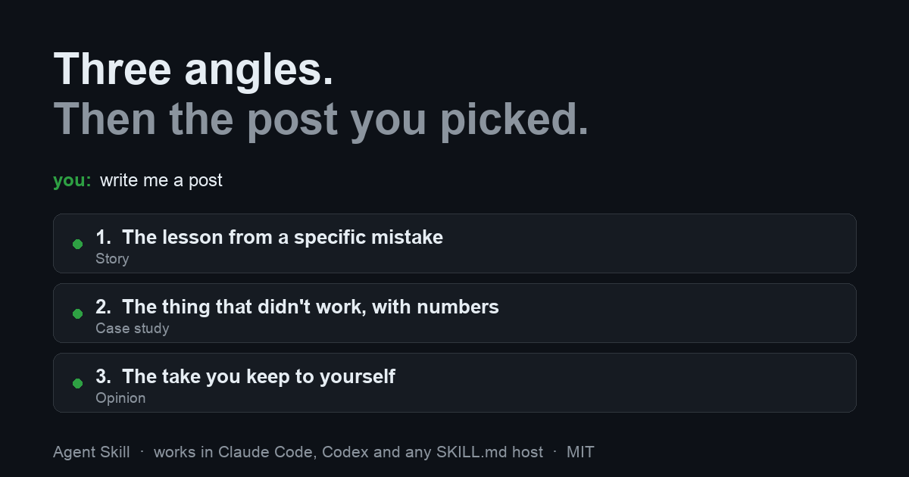

<p align="center">
  
</p>

# publora-post-ideas

<p align="center">
  
  
  
  
  
  
</p>

**An Agent Skill that offers you three different angles for a social post, then writes the one you pick.**

It stops at the draft. It never invents the personal detail. Those two rules are
the whole design, and the rest of this file explains why.

## Why I made this

Someone told me they stay with their scheduling tool mostly because of its post
templates. When they run out of ideas, the templates give them a way back in.
That stuck with me. It is not the part of the job I would have guessed people
get stuck on.

Asking an agent to "write me a post" has the same problem from the other side.
You get one draft, produced on the first guess. You read it, you are not
convinced, and there is nothing specific to push back on, so you rewrite it
yourself and the agent saved you nothing.

This changes the first move. The skill looks at what you have already published,
offers three angles from three different categories, and asks which one. Then it
asks for the one thing only you have: the mistake, the number, the name. Then it
writes from that.

## The two rules

**It never invents the personal detail.** Every angle asks for a specific fact
that has to come from you, and the skill is told, more than once, that inventing
it is the failure mode of the whole thing. A post with a fabricated failure in it
reads plausible, is false, and goes out under your own name.

**It stops at the draft.** Nothing is published or scheduled from this skill. It
shows you the finished text and hands off; publishing stays a separate,
deliberate step.

## What is in it

- `skills/publora-post-ideas/SKILL.md`: how the agent chooses angles, what it
  has to ask before drafting, what it checks in the text, and what it is never
  allowed to invent.
- `skills/publora-post-ideas/references/angles.md`: the angle library across
  eight categories: Story, Behind the scenes, Tip, Case study, List, How-to,
  Opinion, Question. Each entry names the specific fact that has to come from you.
- `references/hooks.md`: what the first two lines have to do before the feed
  collapses the rest, and the openings that reliably fail.
- `references/voice.md`: how to read a voice off someone's existing posts rather
  than asking them to describe it, and what must never be carried over from a
  source article.
- `references/machine-tells.md`: the patterns that give a draft away after every
  automated check has passed.
- `references/platforms.md`: how one angle changes shape across LinkedIn, X,
  Threads, Bluesky, Telegram and the networks that need media first.

## Install

One command, whichever agent you use:

```bash
npx skills add publora-team/publora-post-ideas
```

That's the [skills CLI](https://github.com/vercel-labs/skills). It detects your
agent and puts the skill where that agent looks for it, so it covers Claude
Code, Codex, Cursor and Copilot without you choosing a path. Add `--global` to
install for every project instead of the current one.

### By hand

If you'd rather not run someone else's installer, clone it and copy the folder:

```bash
git clone https://github.com/publora-team/publora-post-ideas.git /tmp/ppi
```

### Claude Code

```bash
cp -r /tmp/ppi/skills/publora-post-ideas ~/.claude/skills/
```

For a single project, use `.claude/skills/` inside the project instead.

### Codex CLI

```bash
cp -r /tmp/ppi/skills/publora-post-ideas ~/.codex/skills/
```

For a single project, use `.codex/skills/`. Restart Codex afterwards so it
reloads skill metadata.

### Any other SKILL.md host

`SKILL.md` is the open Agent Skills format, so the same folder works anywhere
that reads it. Copy `skills/publora-post-ideas` into that host's skills
directory and restart it.

I have run this in Claude Code. The skill is plain Markdown with one reference
file and no scripts, so there is nothing platform-specific in it to break
elsewhere, but the other hosts are untested by me.

## With Publora connected

It works on its own. The angle library is a text file and the draft comes back
as text you can paste anywhere.

Connected to [Publora](https://publora.com), it also reads what you have
actually published, so the angles are chosen against your real feed instead of
in the abstract, the rotation is real rather than guessed, and the finished post
can go into a queue instead of your clipboard. Publora's Starter plan is free
forever and includes the API and MCP access this uses.

```json
{
  "mcpServers": {
    "publora": {
      "type": "http",
      "url": "https://mcp.publora.com/mcp",
      "headers": { "Authorization": "Bearer <PUBLORA_API_KEY>" }
    }
  }
}
```

The key comes from the Publora dashboard. Clients that read the official MCP
registry find the same server as `com.publora/mcp-server`.

## Related

Publora also publishes a set of per-network publishing skills:
[publora/skills](https://github.com/publora/skills) covers LinkedIn, Instagram,
TikTok, Threads, X, Bluesky, Telegram and a general one. This repository is the
part that happens before those: deciding what to say.

## License

MIT
